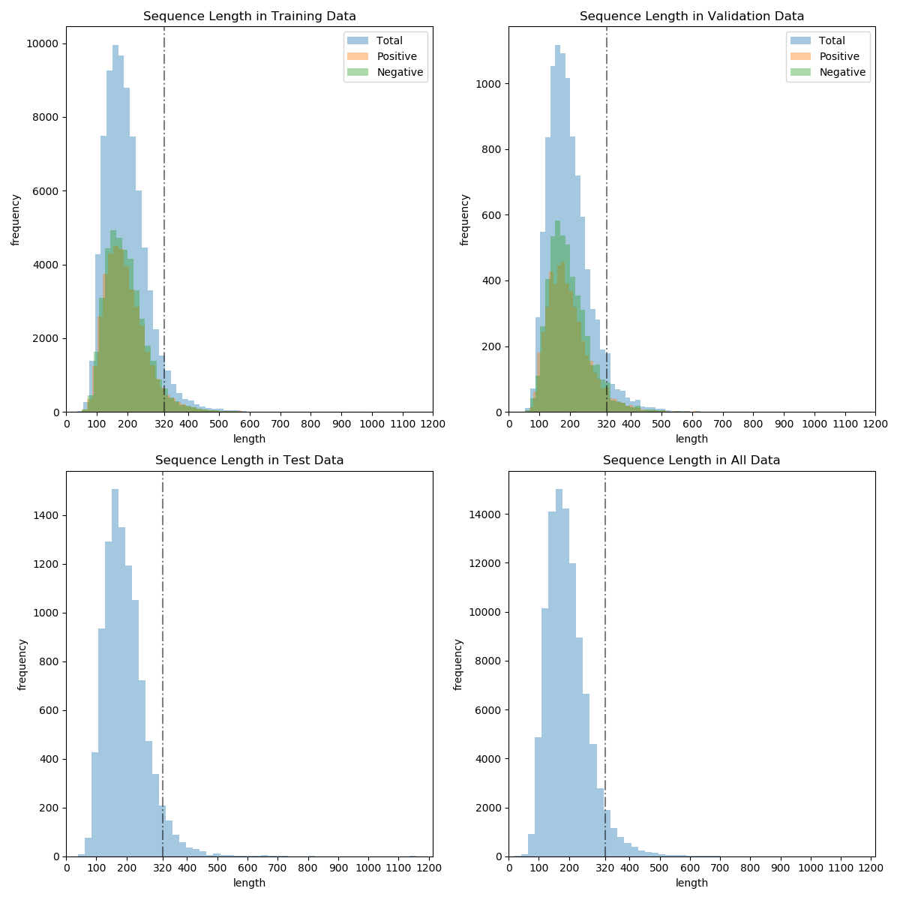
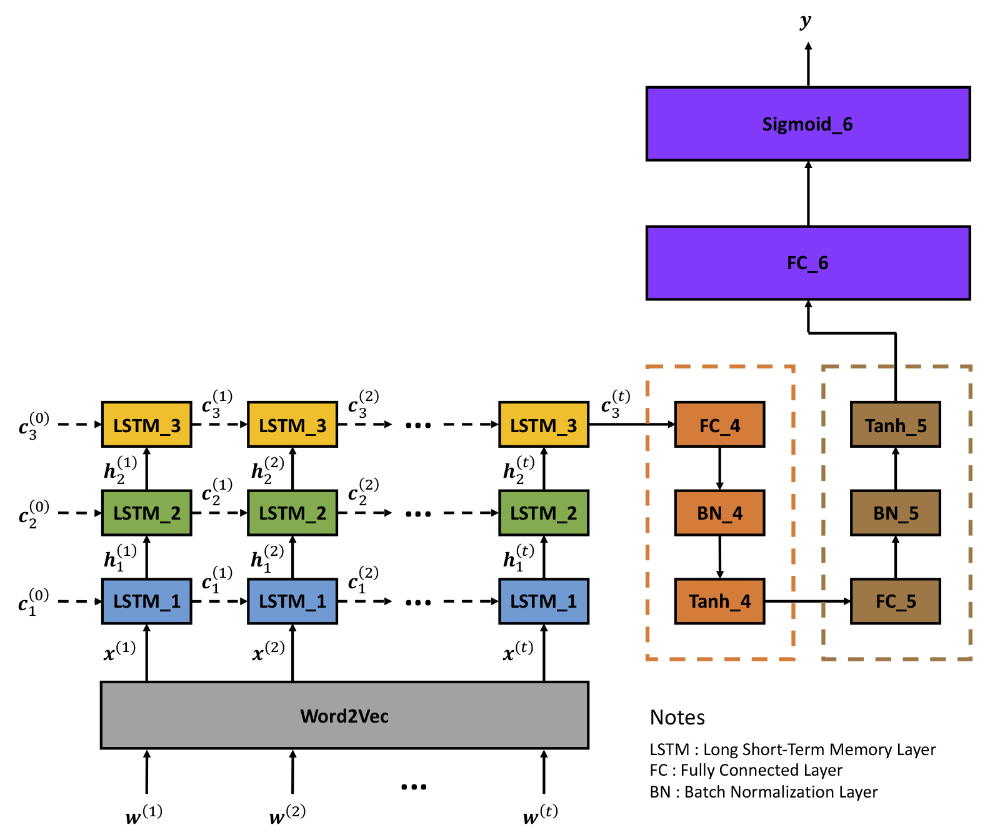
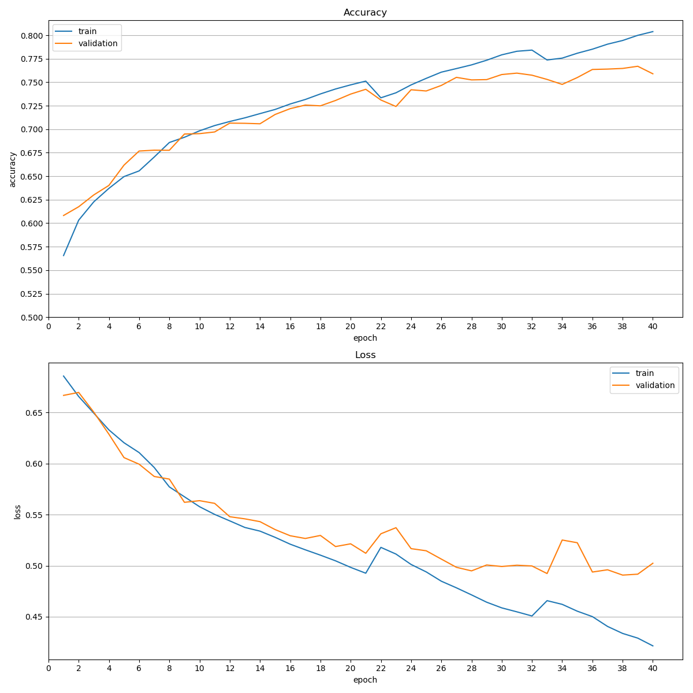

# 语篇连贯性二分类任务

潘学海 1500011317

## 数据集分析及数据预处理

​	为了便于采用常用的全连接层及 Softmax 函数 (对于二分类任务等价于 Sigmoid 函数) 进行分类任务。我们首先使用 Word2Vec 模型先将语料数据中的每一个词转换为词向量。这里我们选择 `gensim` 包中的 `Word2Vec` 模型，对 train、valid、test 数据集中的所有语料进行训练，以获得数据集中每个词的词向量。在实验中我们选取的词向量大小为 128，对该模型训练了 40 个 epoch，训练完成后则固定参数，以保证后续的分类任务的数据的一致性。
​	获得词向量后，我们需要对句子对应的词向量序列提取特征，这里我们采用多层 LSTM 作为特征提取器。但 RNN 网络中我们需要提前获知序列长度，而在数据集中各个语句的长度不尽相同，其分布如下图所示：



由上图可知，三个数据集的语句长度分布近似相同，其中长度为 200 左右的句子最多，且大部分句子的长度不超过 400。为尽量保留原始句子的信息，但又考虑到空间和时间的利用率，我们在实验中将语句长度固定为 320。超出者则进行截断，不足者则进行末尾补零操作，使得数据集中的每个句子对应的词向量序列的长度相同，均为 320。

## 分类器模型搭建

​	获得每个句子的词向量序列，我们采用多层 LSTM 网络对句子进行特征提取，后接多个全连接层作为分类器。网络结构如下图所示：



三个 LSTM 的输入维度均为 $320 \times 128$，而三个全连接层的神经元数目分别为 $128 \times 64$、$64\times 32$ 和 $32 \times 1$。为提高模型的鲁棒性，我们在每个 LSTM 输出前加入了系数为 $0.2$ 的 dropout。同时为了提高网络训练速度和训练稳定性，我们在两个全连接层后先做 Batch Normalization 再做激活。

​	构建分类器网络的 Python 代码及各层网络参数如下：

```Python
from tensorflow import keras

SEQ_LEN = 320
VEC_SIZE = 128

# Inputs #####################################################################
inputs = keras.layers.Input(shape = (SEQ_LEN, VEC_SIZE), name = 'inputs')    #
##############################################################################
# LSTM block 1 ###############################################################
LSTM_1 = keras.layers.LSTM(units = 128, input_shape = (SEQ_LEN, VEC_SIZE),   #
                           dropout = 0.2, return_sequences = True,           #
                           name = 'LSTM_1')                                  #
x = LSTM_1(inputs)                                                           #
##############################################################################
# LSTM block 2 ###############################################################
LSTM_2 = keras.layers.LSTM(units = 128, input_shape = (SEQ_LEN, 128),        #
                           dropout = 0.2, return_sequences = True,           #
                           name = 'LSTM_2')                                  #
x = LSTM_2(x)                                                                #
##############################################################################
# LSTM block 3 ###############################################################
LSTM_3 = keras.layers.LSTM(units = 128, input_shape = (SEQ_LEN, 128),        #
                           dropout = 0.2, return_state = True,               #
                           name = 'LSTM_3')                                  #
_, _, x = LSTM_3(x)                                                          #
##############################################################################
# Dense block 4 ##############################################################
Dense_4 = keras.layers.Dense(units = 64, input_dim = 128,                    #
                             activation = None, name = 'Dense_4')            #
BatchNorm_4 = keras.layers.BatchNormalization(name = 'BatchNorm_4')          #
Tanh_4 = keras.layers.Activation(activation = 'tanh', name = 'Tanh_4')       #
x = Dense_4(x)                                                               #
x = BatchNorm_4(x)                                                           #
x = Tanh_4(x)                                                                #
##############################################################################
# Dense block 5 ##############################################################
Dense_5 = keras.layers.Dense(units = 32, input_dim = 64,                     #
                             activation = None, name = 'Dense_5')            #
BatchNorm_5 = keras.layers.BatchNormalization(name = 'BatchNorm_5')          #
Tanh_5 = keras.layers.Activation(activation = 'tanh', name = 'Tanh_5')       #
x = Dense_5(x)                                                               #
x = BatchNorm_5(x)                                                           #
x = Tanh_5(x)                                                                #
##############################################################################
# Dense block 6 ##############################################################
Dense_6 = keras.layers.Dense(units = 1, input_dim = 32,                      #
                             activation = None, name = 'Dense_6')            #
Sigmoid_6 = keras.layers.Activation(activation = 'sigmoid',                  #
                                    name = 'Sigmoid_6')                      #
x = Dense_6(x)                                                               #
outputs = Sigmoid_6(x)                                                       #
##############################################################################

model = keras.Model(inputs = inputs, outputs = outputs)
```

​	对于二分类任务，我们采用 binary cross-entropy loss，模型的目标函数定义为：

$$
L(\theta) = \frac{1}{N} \sum_{i = 1}^N L(f(x_i;\theta), y_i) = -\frac{1}{N} \sum_i \left[ y_i \ln (f(x_i;\theta)) + (1 - y_i) \ln (1 - f(x_i;\theta))) \right] \notag
$$

## 分类器训练

​	我们采用 RMSProp 算法对目标函数进行优化，训练参数如下：

| Parameter                | Value |
| ------------------------ | ----- |
| Learning rate $\eta$     | 0.001 |
| Forgetting factor $\rho$ | 0.9   |
| Learning rate decay      | 1E-4  |
| Batch size               | 64    |

​	模型精度及损失函数随训练过程的变化图如下图所示：



​	从图中我们可以看出在第 25 个 epoch 之后，模型在 validation 数据集上的精度及 loss 均变化不大，而在 train 数据集上仍随着训练的进行不断改善。为防止模型过拟合，以及为提高模型的泛化能力，我们提前终止了训练。

## 分类器预测实验

​	为提高分类器的精度，我们使用了 ensemble 方法。训练过程中在 validation 数据集上精度最高的 5 个模型如下：

| No. | epoch | train_accuracy | train_loss | validation_accuracy | validation_loss |
|:--|:--|:--|:--|:--|:--|
| 1 | 39 | 0.799913 | 0.429051  | 0.7670 | 0.491675|
| 2 | 38 | 0.794425 | 0.433637  | 0.7647 | 0.490780|
| 3 | 37 | 0.790513 | 0.440510  | 0.7640 | 0.495986|
| 4 | 36 | 0.785187 | 0.450102  | 0.7636 | 0.493772|
| 5 | 31 | 0.782950 | 0.454800  | 0.7597 | 0.500460|

由表可知，在 validation 数据集上，单个模型精度最高达到了 $76.70 \%$。而对于 ensemble 模型，我们在 validation 数据集上做了评测实验，其精度为 $77.19\%$。